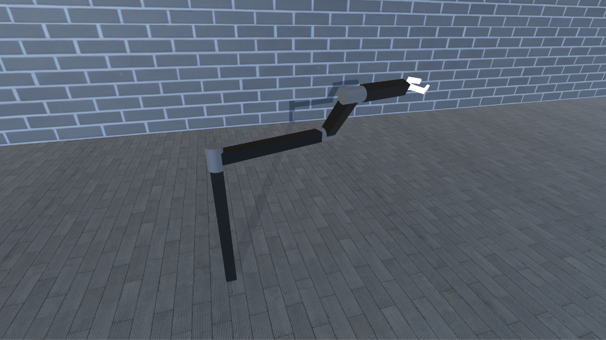
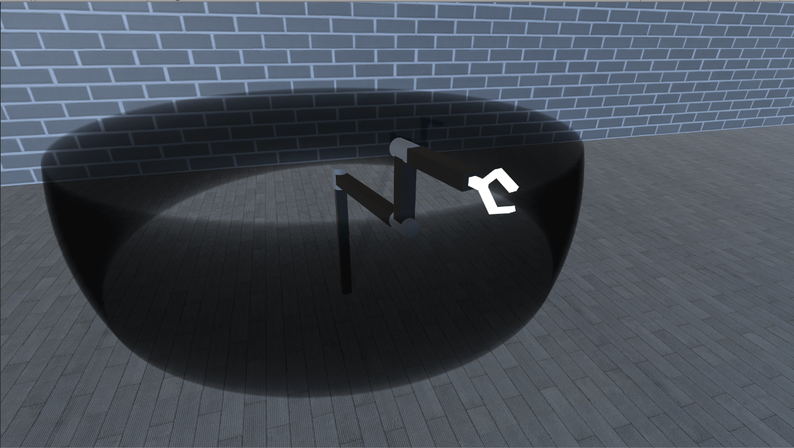

# Robotic-Arm-Project

### Description
Project created due to "Robotics" study course.
Target was to implement forward kinematics and inversed kinematics to assigned manipulator type (in this project the type is: RRR |--).
Addotionaly there is a functionality showing working volume of mentioned manipulator. By moving sliders, rotation of joints changes.
By passing a 3D point, manipulator changes its configuration so that the TCP is placed in passed 3D point if it is in the working volume.

### Robot overview

### Working envelope

